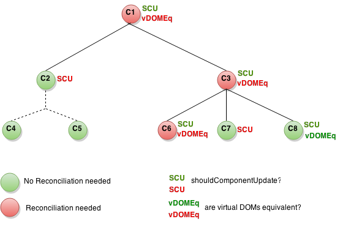

# 2.12 - Rendimiento

React crea y mantiene una representación interna de la interfaz de usuario renderizada. Incluye los elementos React que devuelven nuestros componentes. Esta representación permite a React evitar la creación de nodos DOM y acceder a los existentes más allá de la necesidad, ya que puede ser más lento que las operaciones en objetos JavaScript. A veces se le conoce como un "DOM virtual", pero funciona de la misma manera en React Native.

> Cuando las propiedades de un componente o el estado cambian, React decide si una actualización DOM real es necesaria comparando el elemento recién devuelto con el previamente renderizado. Cuando no son iguales, React actualizará el DOM.

En algunos casos, nuestros componente puede _acelerar_ esto sobreescribiendo la función `shouldComponentUpdate`, que se activa antes de que se inicie el proceso de re-renderizado. La implementación predeterminada de esta función devuelve `true`.

## Cómo funciona shouldComponentUpdate

La siguiente imagen representa un subárbol de componentes. Para cada uno, `SCU` indica lo que `shouldComponentUpdate`ha devuelto y `vDOMEq` indica si los elementos React renderizados eran equivalentes. Finalmente, el color del círculo indica si el componente tuvo que ser reconciliado o no.



Debido a que `shouldComponentUpdate` devolvió `false` para el subárbol C2, React no intentó renderizar C2 y, por lo tanto, ni siquiera tuvo que invocar a `shouldComponentUpdate` en C4 y C5.

Para C1 y C3, `shouldComponentUpdate` devolvió `true`, por lo que React tuvo que bajar a las _hojas_ y comprobarlos. Para C6 `shouldComponentUpdate` ha devuelto `true` y dado que los elementos renderizados no eran equivalentes React tenía que actualizar el DOM.

React tuvo que renderizar C8, pero como los elementos React devueltos eran iguales a los renderizados previamente, no tenía que actualizar el DOM.

Tenga en cuenta que React sólo tuvo que hacer mutaciones DOM para C6, que era inevitable. Para C8, reutilizó los elementos renderizados anteriormente, y para el subárbol de C2 y C7, ni siquiera tuvo que comparar los elementos y el `render` no fue ni llamado.

```javascript
class CounterButton extends React.Component {
  constructor(props) {
    super(props);
    this.state = {count: 1};
  }

  shouldComponentUpdate(nextProps, nextState) {
    if (this.props.color !== nextProps.color) {
      return true;
    }
    if (this.state.count !== nextState.count) {
      return true;
    }
    return false;
  }

  render() {
    <button
      color={this.props.color}
      onClick={() => this.setState(state => ({count: state.count + 1}))}>
      Count: {this.state.count}
    </button>
  }
}
```

Puesto que, en la mayoria de los casos, ese tipo de compareciones es sufuciente, podemos ahorrarnos dicha implementación heredando de `PureComponent`.

```javascript
class CounterButton extends React.PureComponent {
  constructor(props) {
    super(props);
    this.state = {count: 1};
  }

  render() {
    <button
      color={this.props.color}
      onClick={() => this.setState(state => ({count: state.count + 1}))}>
      Count: {this.state.count}
    </button>
  }
}
```

## Inmutabilidad de los datos

Sobre este tema se puede escribir una tesis doctoral. [Este artículo](http://reactkungfu.com/2015/08/pros-and-cons-of-using-immutability-with-react-js/) elabora sobre los pros y cons de la inmutabilidad de los datos. Facebook propociona - fuera de React -una libreria para trabajar con datos inmutables llamada [Immutable.js](https://github.com/facebook/immutable-js)

Este capítulo lo veremos más en detalle en el apartado de Redux.

## Perf addon

Es un _addon_ que proporciona React para la fase de desarrollo y que no se puede ejecutar en modo prod. Para usarlo deberemos importarlo como cualquier otro paquete de npm

```javascript
import Perf from 'react-addons-perf';
```

**Obtención de mediciones**

* start\(\)
* stop \(\)
* getLastMeasurements \(\)

**Impresión de resultados**

Los siguientes métodos utilizan las mediciones devueltas por `Perf.getLastMeasurements()` para imprimir de una manera legible los resultados.

* printInclusive\(\) - tiempo total
* printExclusive\(\) - tiempo sin contar el montaje de componentes \(`componentWillMount`, `componentDidMount`, procesar las `props`, etc\).
* printWasted\(\) - tiempo _perdido_ en renderizar componentes que no requirieron actualizar el DOM
* printOperations\(\) - operaciones reales al manipular el DOM

