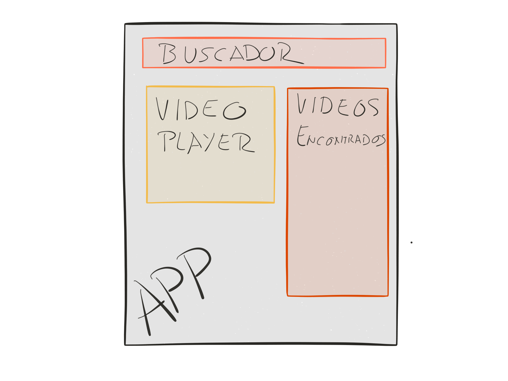

# 2.14 - Ejercicios

## Crear la aplicación que vamos a hacer

Primero creamos la aplicación con `create-react-app youtube-search`. Una vez finalizado, probamos que funciona con `npm start`.

## Requerimientos extra

Necesitaremos instalar los paquete de npm `youtube-api-search` y `lodash` \(o `debounce`. Y crear un clave de API de youtube en la [consola de developer de google](https://console.developers.google.com/apis).

También añadiremos semantic-ui instalandolo en el proyecto con npm. Una vez instalado, vamos a la carpeta semantic y ejecutamos `gulp build`.

## Estructura de la aplicación



## App.js

```javascript
import debounce from 'debounce';
import React, { Component } from 'react';
import YTSearch from 'youtube-api-search';

import SearchBar from './components/search_bar';
import VideoList from './components/video_list';
import VideoDetail from './components/video_detail';

import logo from './logo.svg';
import './App.css';

import '../semantic/dist/semantic.css';
import '../semantic/dist/semantic.js';

const API_KEY = 'xxxxxx-pEVftsbrsTVx7UW-xxx';

class App extends Component {
  constructor(props) {
    super(props);
    this.state = {
      selectedVideo: null,
      videos: [],
    };
    this.videoSearch('surfboards');
  }

  videoSearch(term) {
    YTSearch({ key: API_KEY, term }, (videos) => {
      this.setState({
        videos,
        selectedVideo: videos[0],
      });
    });
  }

  render() {
    const videoSearch = debounce((term) => { this.videoSearch(term);}, 300);
    return (
      <div className="ui center aligned stackable grid container">
        <div className="sixteen wide column">
          <SearchBar onSearchTermChange={videoSearch} />
        </div>
        <div className="seven wide column">
          <VideoDetail video={this.state.selectedVideo} />
        </div>
        <div className="nine wide column">
          <VideoList
            onVideoSelect={selectedVideo => this.setState({ selectedVideo })}
            videos={this.state.videos}
          />
        </div>
      </div>
    );
  }
}

export default App;
```

## SearchBar

```javascript
import React, { Component } from 'react';

class SearchBar extends Component {
  constructor(props) {
    super(props);
    this.state = {
      placeholder: 'Type your search criteria here ...',
      term: '',
    };
  }

  onInputChange(term) {
    this.setState({ term });
    this.props.onSearchTermChange(term);
  }

  render() {
    return (
      <div className="ui fluid icon input">
        <input type="text" placeholder="Search..."
          value={this.state.term}
          placeholder={this.state.placeholder}
          onChange={ev => this.onInputChange(ev.target.value)}
        />
        <i className="search icon"></i>
      </div>
    );
  }
}

SearchBar.propTypes = {
  onSearchTermChange: React.PropTypes.any,
};
export default SearchBar;
```

## Video list

```javascript
import React from 'react';
import VideoListItem from './video_list_item';

const VideoList = (props) => {
  const videoItems = props.videos.map((video) => {
    return (
      <VideoListItem
        onVideoSelect={props.onVideoSelect} key={video.etag} video={video}
      />
    );
  });

  return (<div className="ui container">
    <h2 className="ui header dash_header">
      <i className="list layout icon"></i>
      <div className="content">Video list
        <div className="sub header">Retrieved videos from youtube</div>
      </div>
    </h2>
    <div className="ui doubling stackable cards">
      {videoItems}
    </div>
  </div>);
};

export default VideoList;
```

## VideoListItem

```javascript
import React from 'react';

const VideoListItem = ({ video, onVideoSelect }) => {
  return (
    <div className="ui stackable link card" onClick={() => onVideoSelect(video)}>
      <div className="image">
       
      </div>
      <div className="content">
        <a className="header">{video.snippet.title}</a>
        <div className="meta">
          <span className="date">{video.snippet.publishedAt}</span>
        </div>
        <div className="description">
          {video.snippet.description}
        </div>
      </div>
      <div className="extra content">
        <a>
          <i className="youtube icon"></i>
          {video.snippet.channelTitle}
        </a>
      </div>
    </div>
  );
};

export default VideoListItem;
```

## VideoDetail

```javascript
import $ from 'jquery';
import React, { Component } from 'react';

class VideoDetail extends Component {
  componentDidUpdate() {
    const $node = $(this.videoPlayer);
    $node.embed({
      source: 'youtube',
      id: this.props.video.id.videoId,
      placeholder: this.props.video.snippet.thumbnails.high.url,
    });
    $node.embed('change', 'youtube', this.props.video.id.videoId,
      `https://www.youtube.com/embed/${this.props.video.id.videoId}`);
  }

  render() {
    if (!this.props.video) {
      return (<div className="ui inverted active dimmer">
        <div className="ui text loader">Loading</div>
      </div>);
    }
    return (<div className="ui container">
      <h2 className="ui header dash_header">
        <i className="youtube icon"></i>
        <div className="content">Selected video</div>
      </h2>
      <div className="ui embed" ref={(c) => (this.videoPlayer = c)}></div>
    </div>);
  }
}
VideoDetail.propTypes = {
  video: React.PropTypes.any,
};

export default VideoDetail;
```

### Extras

Renderizado condicional Listas y propiedad key

