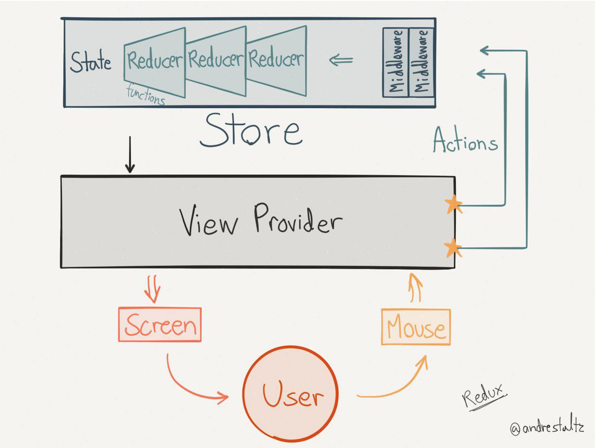

# 3.2 - Introducción

En su site oficial, se define como _a predictable state container for JavaScript apps_. Lo cual se podría traducir como contenedor de estados predecibles para aplicaciones javascript.

## Los 3 principios de Redux:

Redux basa su funcionamiento en 3 principios clave:

1. **Una sola fuente de datos \(SSOT\)**: El estado de la aplicación se almacena en un árbol de objetos dentro de una única _STORE_. Esto hace que sea más fácil depurar una aplicación y sea más rápido su desarrollo.
2. **El estado es sólo de lectura**: La única manera que tenemos de cambiar el estado será mediante _ACTIONS_. Así nos aseguramos que la vista nunca modifica el estado, sino que expresa su intención de mutar.
3. **Las mutaciones se escriben como funciones puras**: Para especificar como cambiará el estado por las acciones, se utilizan los _REDUCERS_, que son funciones puras a las que pasamos el estado anterior y la acción a realizar devolviendo un nuevo estado de la aplicación, en lugar de modificar el estado anterior.

Otro dibujito para comparar con lo anterior

