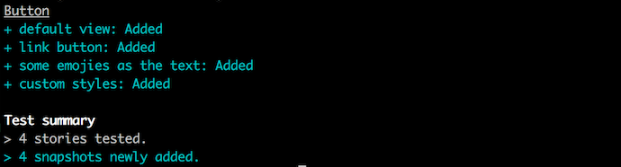
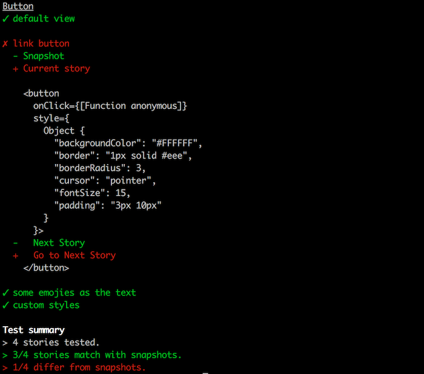
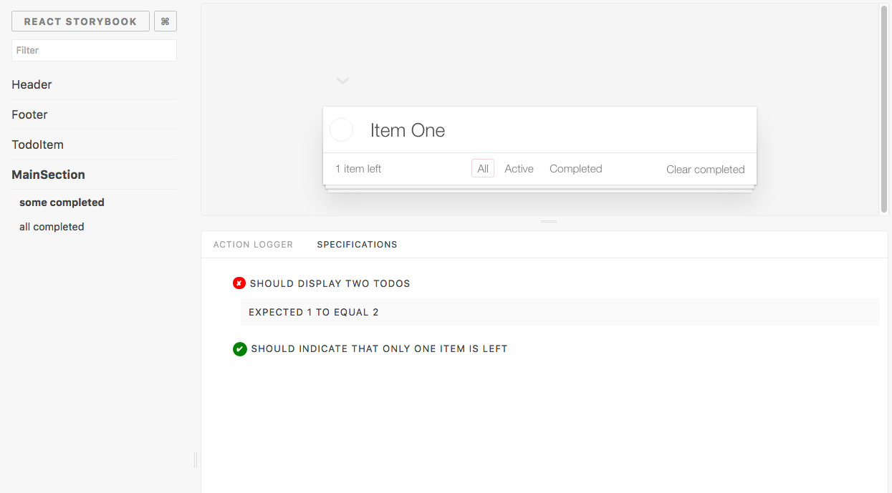

# 4.1 - UI Testing

Dado que React es _**sólo**_ una capa de vista, es importante asegurarse que esta es correcta. Para aseguranos de esto, usaremos Storybook que nos proporciona diferentes tipos de test

## Test estructurales

Supongamos que tenemos una pantalla que login de facebook así


Aquí nos enfocaremos en la estructura de la interfaz de usuario y en cómo está diseñada. Para las pruebas estructurales, estamos probando si tiene o no el siguiente contenido:

* Un título con "Iniciar sesión en Facebook"
* Dos entradas para el nombre de usuario y la contraseña.
* Un botón de envío.
* Una pantalla de error para mostrar errores.

Para React, podemos usar `Enzyme` como una forma de hacer pruebas estructurales, pero ahora también podemos usar snapshots testing de `Jest` para hacer las cosas aún más simples.

Con _snapshot testing_, mantenemos una copia de archivo de la estructura de los componentes de la interfaz de usuario. Luego, cuando hayamos completado los cambios en la interfaz de usuario, comparamos nuevas instantáneas con las instantáneas que guardamos en el archivo.

Si las cosas no son las mismas, podemos hacer dos cosas:

* Podemos considerar nuevas instantáneas que muestren el estado actual y luego actualizarlas como nuevas instantáneas.
* Podemos encontrar la causa raíz del cambio y arreglar nuestro código.

### Para usarlo

Instalar con `npm i -D @kadira/storyshots` y añadir al `package.json` la siguiente linea dentro de la sección de scripts `"test-storybook": "storyshots"`. Ya podemos ejecutarlos con `npm run test-storybook`

La primera vez guardará los _snapshots_



La siguiente vez, si hemos cambiado algo veremos una pantalla como esta



## Test de interacción

El interfaz de usuario todo trata de interactuar con el usuario. Hacemos esto con un montón de elementos de la interfaz de usuario, como botones, vínculos y elementos de entrada. Con las pruebas de interacción, necesitamos probar si funcionan correctamente.

Vamos a utilizar de nuevo el componente de inicio de sesión anterior como un ejemplo. Debe hacer estas cosas:

* Cuando hacemos clic en el botón Enviar, debe darnos el nombre de usuario y la contraseña.
* Cuando hacemos clic en el enlace "Cuenta olvidada", debe redirigir a una nueva página.

Tenemos pocas maneras de hacer este tipo de pruebas con React. La forma más sencilla es usar Enzyme.

### Para usarlo

Podemos usar Enzyme para simular interacciones escribiendo las especifiaciones usando Mocha o Jest.

```javascript
class Foo extends React.Component {
  constructor(props) {
    super(props);
    this.state = { count: 0 };
  }
  render() {
    const { count } = this.state;
    return (
      <div>
        <div className={`clicks-${count}`}>
          {count} clicks
        </div>
        <a onClick={() => this.setState({ count: count + 1 })}>
          Increment
        </a>
      </div>
    );
  }
}

const wrapper = mount(<Foo />);

expect(wrapper.find('.clicks-0').length).to.equal(1);
wrapper.find('a').simulate('click');
expect(wrapper.find('.clicks-1').length).to.equal(1);
```

También podemos usar el addon de react-storybook instalándolo con `npm install -D storybook-addon-specifications` y escribiendo la especificación dentro de las historias

```javascript
import { storiesOf } from '@kadira/storybook'
import { specs, describe, it } from 'storybook-addon-specifications'

import {mount} from "enzyme";
import expect from "expect";

const stories = storiesOf('Button', module);

stories.add('Hello World', function () {
  const story =
    <button onClick={action('Hello World')}>
      Hello World
    </button>;

  specs(() => describe('Hello World', function () {
    it('Should have the Hello World label', function () {
      let output = mount(story);
      expect(output.text()).toContain('Hello World');
    });
  }));

  return story;
});
```

Se vería algo así



## Test de estilos

La interfaz de usuario tiene que ver con estilos \(por muy feos que estos puedan ser, deben ser probados\). Con las pruebas de estilo, estamos evaluando la apariencia de nuestros componentes de interfaz de usuario entre los cambios de código. Este es un tema bastante complejo y usualmente lo hacemos comparando imágenes.

Si estamos usando estilos en línea todo el camino, podemos usar los snapshosts de Jest. Pero para obtener resultados aún mejores, debemos considerar el uso de herramientas tales como:

* BackstopJS
* PhantomCSS
* Gemini
* Happo

**Más detellaes de cómo escribir historias con react-storybook** [https://getstorybook.io/docs/react-storybook/basics/writing-stories](https://getstorybook.io/docs/react-storybook/basics/writing-stories)

