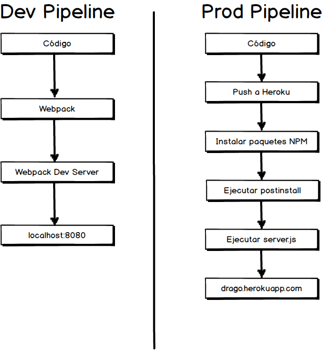

# 5.0 - Despliegue

_Esta sección entra más dentro de las responsabilidades de webpack. Configurar webpack requiere un curso por si mismo por lo que aquí sólo se monstrará una pincelada_

Lo primero que tenemos que tener en cuenta es que tendremos dos _pipelines_. Una para desarrollar y otra para desplegar. En este caso, vamos a usar Heroku como servidor.



**Cambios en package.json**

Añadimos estas dos lineas en la sección de scripts

```text
"postinstall": "webpack -p",
"start": "node server.js"
```

**server.js**

```javascript
const express = require('express');
const path = require('path');
const port = process.env.PORT || 8080;

const app = express();
app.use(express.static(__dirname));

app.get('*'. (req, res) => {
  res.sendFile(path.resolve(__dirname, 'index.html'));
});

app.listen(port);
console.log('Server started');
```

## Usando create-react-app ...

### ... localmente

Una vez que hemos preparado la versión de producción con `npm run build`, podemos probar con un servidor local de estáticos \(pushstate\) que para cualquier ruta nos devolverá `index.html` a no ser que sea otro tipo de estático como una imagen, en cuyo caso nos devolverá dicho fichero. Para ellos, seguimos estos tres pasos.

```text
npm install -g pushstate-server
pushstate-server build
open http://localhost:9000
```

### ... con Heroku

Heroku tiene ya implementado el proceso de despliegue para aplicaciones creadas usando `create-react-app`.

El proceso sería

```text
npm install -g create-react-app
create-react-app my-app
cd my-app
git init
heroku create -b https://github.com/mars/create-react-app-buildpack.git
git add .
git commit -m "react-create-app on Heroku"
git push heroku master
heroku open
```

### ... en AWS

Pues que create-react-app se orienta a web estáticas que hacen uso de datos servidor por APIs, podemos aprovechar estos servicios usando S3 o CloudFront.

Los detalles los podéis encontrar [en este artículo de medium](https://medium.com/@omgwtfmarc/deploying-create-react-app-to-s3-or-cloudfront-48dae4ce0af#.3fzgzixy5)

