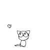

# Generadores

Los generadores son funciones de las que se puede salir y volver a entrar. Su contexto (asociación de variables) será conservado entre las reentradas.

La declaración `function*` (la palabra clave function seguida de una asterisco) define una función generadora, que devuelve un objeto `Generator`. También se puede definir funciones generadora usando el constructor GeneratorFunction y una function* expression.

```js
function* nombre([param[, param[, ... param]]]) {
   instrucciones
}
```

La llamada a una función generadora **no ejecuta su cuerpo inmediatamente**. Se devuelve un objeto `iterador` para la función en su lugar. El cuerpo de la función del generador se ejecuta hasta la primera expresión de rendimiento, que especifica el valor a devolver desde el iterador o, con el rendimiento `*`, delega a otra función del generador. El siguiente método devuelve un objeto con una propiedad `value` que contiene el valor `yield` y una propiedad `done` que indica si el generador ha producido su último valor.


A ver si con unos ejemplos mejora la cosa

```js
function* idMaker(){
  var index = 0;
  while(index < 3)
    yield index++;
}

var gen = idMaker();

console.log(gen.next().value); // 0
console.log(gen.next().value); // 1
console.log(gen.next().value); // 2
console.log(gen.next().value); // undefined
// ...
```

Ahora un ejemplo con yield*

```js
function* anotherGenerator(i) {
  yield i + 1;
  yield i + 2;
  yield i + 3;
}

function* generator(i){
  yield i;
  yield* anotherGenerator(i);
  yield i + 10;
}

var gen = generator(10);

console.log(gen.next().value); // 10
console.log(gen.next().value); // 11
console.log(gen.next().value); // 12
console.log(gen.next().value); // 13
console.log(gen.next().value); // 20
```

Para qué sirve esto lo veremos más adelante. 

**¡¡¡Spoiler alert!!!** Obtener datos remotos 🤔 

