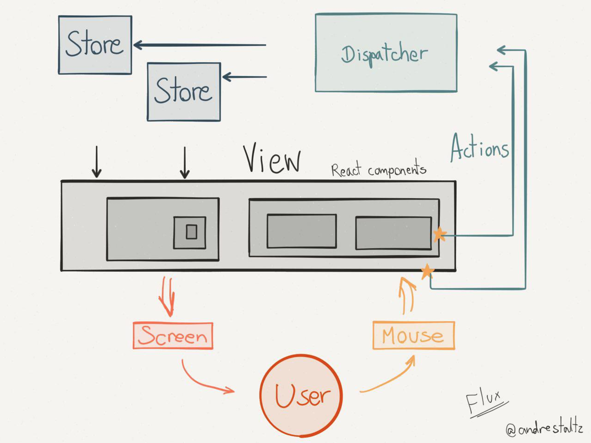

# Flux, los origenes

Flux es la arquitectura que recomienda Facebook para complementar con React. Se compone de 3 grandes partes: – Dispatchers – Stores – Views Una cuarta pieza más pequeña sería la Controller-View, una vista que gestiona varias vistas. Flux se centra en el flujo de la información que deja de ser bidireccional para convertirse en un flujo unidireccional, esto es una de las características más importantes de Flux.

Las *Actions* son los diferentes tipos de operaciones que se pueden producir en nuestra aplicación, acciones como el usuario ha hecho click en un botón, se ha completado una petición, se ha añadido un item al carrito, se ha borrado un item del carrito, etc… Las acciones son eventos de Javascript, con el añadido de que les estamos dando nombres de dominio lo cual ayuda mucho para que los distintos desarrolladores del equipo tengan un lenguaje común ante los diferentes eventos del sistema.

El *Dispatcher*, es el encargado de manejar el tráfico de eventos, recibe todas las acciones y decide si quiere o no actuar en consecuencia, puede esperar a recibir varias acciones antes de actuar, etc. Este es el único componente que tiene una implementación concreta y se ofrece como una librería.

Las *Stores* son las piezas intermedias entre el Dispatcher y las vistas, a la vez que mantienen los datos necesarios para luego pintarlos en las vistas. Quizás esta sea una de las partes que mas controversia han generado respecto a este tipo de arquitectura, por lo que han salido otras arquitectura similares, solucionando algunos de los problemas.

En un dibujito un poco más claro

